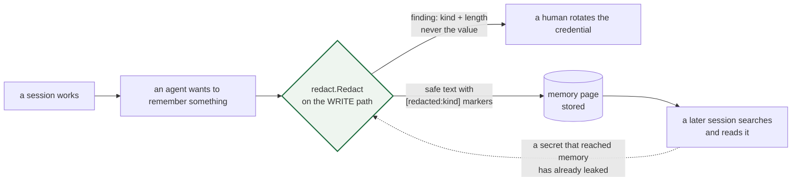

# agent-memory-workflow

How I run a multi-session agent memory system: the rules a session starts with, the handoff one session
leaves for the next, and the redactor that stops a credential from being written into memory in the first
place.

## Start here: `redact`

The failure this package exists for is specific. An agent finishes a debugging session, writes a memory
page, and the page contains the environment variable it was reading or the `curl` command with the token
in it. That memory is then searched by every future session, mirrored into a wiki, and in the bad case
pushed to a public repository. A secret that reaches memory has already leaked — deleting it later is a
cleanup task nobody does.

`redact.Redact` runs on the write path and does two things: it returns text that is safe to store, and it
reports what it removed, by **kind and length — never by value**. A report that quotes the secret is a
second copy of the secret in a second place.

```go
stored, findings := redact.Redact(page)
// stored:   "...the token was in the environment: [redacted:github-token]"
// findings: [{Kind: github-token, Length: 40, Context: "The token was in the environment: [...]"}]
//           -> rotate that token, then fix the thing that put it there
```

What it knows: private key blocks (removed whole), GitHub tokens and fine-grained PATs, AWS access keys,
OpenAI keys, Slack tokens, JWTs, passwords inside connection URIs, and `NAME=value` assignments for names
that are credentials by convention.

What it deliberately does not do: match on words. A redactor that mangles the sentence "the token is
required for every request" — or an example reading `API_KEY=changeme` — is one that gets switched off, and
then nothing is redacted at all. The tests spend as much effort on the false positives as on the secrets,
and one of them asserts that applying the redactor twice changes nothing the second time, because a memory
page is re-read, re-summarised and written again.

```bash
go test -race ./...
```

## Status

Slice one: the redactor and its tests. The rest of the repository — the compose stack that runs the memory
server, the `_rules/` and handoff templates, and the screenshot of a session reading back what an earlier
session wrote — is next. `upstream` is MIT-licensed and is not vendored here; see `docs/credits.md` when it
lands.

## The write path as a picture




`docs/diagrams/redaction-on-the-write-path.html` draws where the redactor sits and why it sits there:
before the page is stored, because by the time it is stored it has been read by a session, mirrored into a
wiki, and maybe pushed. It also carries the finding that cost a push: a test fixture with the exact shape of
a credential is indistinguishable from one to a scanner, which is why the fixtures are assembled from pieces
at run time.

`docs/diagrams/redaction-on-the-write-path.mmd` is the Mermaid version; `make diagram` exports a PNG if a
browser is present.

## The workflow, not just the codec

`redact` is one component. The rest of this repository is how a session behaves around a memory server, and
it is written down because the failure mode is not a crash:

| File | What it decides |
|---|---|
| `_rules/memory-first.md` | Search memory before acting, rate every hit, write down what would have saved you time |
| `templates/handoff.md` | What a handoff contains, including the section that stops the next session repeating a failed approach |
| `templates/stop-verify.md` | The claims to check before saying a task is done — and the two ways it is usually skipped |
| `skills/loop-fix-until-clean/SKILL.md` | Done-condition, iteration ceiling, maker/checker split… and the two failure modes seen in practice |
| `docs/credits.md` | The upstream project is not mine and is not vendored; what is deliberately absent from this repository |

The last one is worth reading first: there are no credentials and no dotfiles here, in the repository or in
its history, and the reason is written down.
